<div align="center">

# `Persona` [Zola](https://www.getzola.org/) Theme


**A modern, responsive and lightweight theme for resume, portfolio, and blog**


[Demo](https://hanson-hschang.github.io/persona-zola-theme/) • [Features](#-features) • [Showcase](#-showcase) • [Installation](#-installation) • [Configuration](#%EF%B8%8F-configuration) • [Troubleshooting](#-troubleshooting) • [Credits](#-credits)

</div>

## ✨ Features

- 🎨 **Modern Design**: Clean and professional layout easy for customization
- 📱 **Fully Responsive**: Optimized for desktop, tablet, and mobile devices
- ⚡️ **Fast Performance**: Lightweight and optimized for speed
- 📋 **Resume/CV Section**: Dedicated section for your resume or CV
- 🎭 **Portfolio Showcase**: Showcase your work with elegant project sections
- 📝 **Blog with TeX**: Built-in blog functionality with $\KaTeX$ support
- 📧 **Contact Forms**: Integrated contact form support with Web3Forms
- 🔍 **Search Ready**: Built-in search index generation

<div align="center">

[](https://pagespeed.web.dev/)

</div>

## 🌟 Showcase

Using `Persona` for your site? 
We'd love to see it! 
Submit a PR to add your site to our showcase.

- [Show Your Site](#-showcase) - Add your site with us!
- [Hanson.HSChang](https://hanson-hschang.github.io/) - Personal website of Heng-Sheng Chang

## 🚀 Installation

This is a Zola theme.
Make sure you have [Zola installed](https://www.getzola.org/documentation/getting-started/installation/) before proceeding.

After [initializing your Zola site](https://www.getzola.org/documentation/getting-started/overview/#initialize-site), the easiest way to install the theme is to add it as a git submodule to your `themes` directory:

```bash
# Navigate to your Zola site directory
cd your-zola-site

# Add the theme as a submodule
git submodule add https://github.com/hanson-hschang/persona-zola-theme.git themes/persona
```

To update the theme:

```bash
# Update the submodule
git submodule update --init --recursive
```

## ⚙️ Configuration

### Basic Setup

1. **Copy the configuration and the landing page content** from the theme to get started quickly:

    ```bash
    # Copy the configuration
    cp themes/persona/config.toml config.toml

    # Copy the landing page content
    cp themes/persona/content/_index.md content/
    ```

2. **Enable the theme** by adding the following line at the beginning of your `config.toml` file:

    ```toml
    theme = "persona"
    ```

3. **Customization** :

  - site settings in your `config.toml`:

    ```toml
    # The URL this site will be built for
    base_url = "https://yourdomain.com"

    # The basic site information
    title = "Your Site Name"
    author = "Your Name"
    description = "Your personal resume, portfolio and blog"

    [extra]

    [extra.persona]
    # Note: landing page title and subtitles are configured in content/_index.md

    # Social links
    social_links = [
      { name = "GitHub", url = "https://github.com/yourusername", icon_class = "bi bi-github" },
      { name = "LinkedIn", url = "https://linkedin.com/in/yourprofile", icon_class = "bi bi-linkedin" },
      { name = "Twitter-X", url = "https://x.com/yourusername", icon_class = "bi bi-twitter-x" },
    ]

    # Contact information
    contact_infos = [
      { item = "Name", content = "Your Name", icon_class = "bi bi-person" },
      { item = "Location", content = "Your City, Country", icon_class = "bi bi-geo-alt" },
      { item = "Email", content = "your.email@example.com", icon_class = "bi bi-envelope" },
      { item = "Phone", content = "+1 (555) 123-4567", icon_class = "bi bi-phone" },
    ]
    ```

  - landing page content in `content/_index.md`:

    ```toml
    +++
    title = "Presented Site Name"
    template = "index.html"
    
    [extra]
    subtitles = "Item 1, Item 2, Item 3"
    +++
    ```

  - Update your assets in `static/assets/img/`:
    - [hero image](https://en.wiktionary.org/wiki/hero_image): `background.jpg`
    - [favicon](https://en.wikipedia.org/wiki/Favicon): `favicon.ico`
    - [apple touch icon](https://developer.apple.com/library/archive/documentation/AppleApplications/Reference/SafariWebContent/ConfiguringWebApplications/ConfiguringWebApplications.html): `apple-touch-icon.png`

### Section Configuration

Each section can be configured with front matter. 
The theme supports three main section types:
- **Plain sections** (for static text content like about)
- **Category sections** (for portfolios, projects, showcases)
- **Blog sections** (for blog posts and articles)

Here is how to set them up:

```toml
+++
title = "Title of the Section"

[extra]
# Section-specific icon for navigation (Bootstrap Icons)
icon_class = "bi bi-person"
# Display order (lower numbers appear first)
order = 1
# Section type determines rendering approach
type = "type"  # "plain", "category", or "blog"
+++
```

## 🆘 Troubleshooting

### Common Issues

- **Theme not loading:**
  - Ensure `theme = "persona"` is set in `config.toml`
  - Check that the theme is in the correct directory: `themes/persona/`

- **Navigation not working:**
  - Ensure sections have proper front matter with `order` field
  - Check that section metadata `extra.type` is correctly specified

- **Contact form not working:**
  - Verify `web3form_public_key` is set in configuration
  - Check [Web3Forms documentation](https://docs.web3forms.com/) for setup

### Getting Help
- Read the [Zola documentation](https://www.getzola.org/documentation/)
- Report issues or request features by [contributing](CONTRIBUTING.md) on GitHub


## 🙏 Credits

[**Persona**](https://github.com/hanson-hschang/persona-zola-theme) is built with and inspired by:

- [**Zola**](https://www.getzola.org/) - A fast static site generator
- [**Bootstrap**](https://getbootstrap.com/) - CSS framework for responsive design
- [**Web3Forms**](https://web3forms.com/) - Contact form service
- [**Bootstrap Icons**](https://icons.getbootstrap.com/) - Icon library
- [**Academicons**](https://jpswalsh.github.io/academicons/) - Academic icons
- [**AOS (Animate On Scroll)**](https://michalsnik.github.io/aos/) - Animation library
- [**Google Fonts**](https://fonts.google.com/) - Font library
- [**Dynamic Badges**](https://shields.io/) - Customizable badges
- [**PageSpeed Insights**](https://github.com/lowlighter/metrics/tree/master/source/plugins/pagespeed) - Automated performance reporting
- [**BootstrapMade Templates**](https://bootstrapmade.com/) - [Active](https://bootstrapmade.com/demo/Active) • [MyResume](https://bootstrapmade.com/demo/MyResume) • [UpConstruction](https://bootstrapmade.com/demo/UpConstruction)
- [**Zola Themes**](https://www.getzola.org/themes/) - [Mabuya](https://mabuya.vercel.app/) • [Vonge](https://pascal-berrang.de/vonge-zola-theme/) • [Zluinav](https://harrymkt.github.io/zluinav/)


---

<div align="center">

**[⭐ Star this repository](https://github.com/hanson-hschang/persona-zola-theme) if you find it helpful!**

</div>